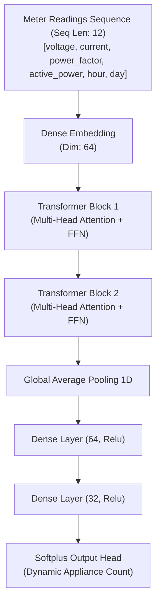
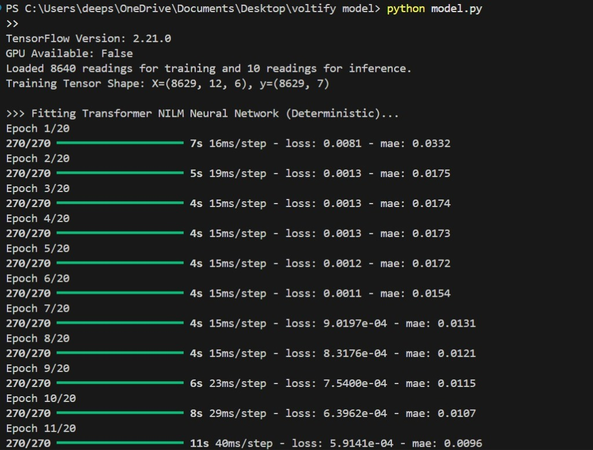
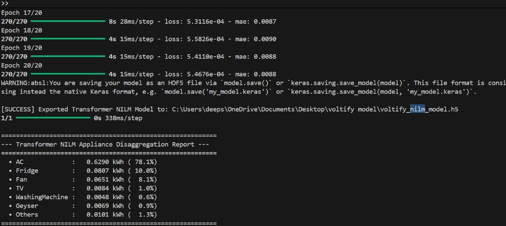

# Voltify AI Engine: Transformer-Based NILM Disaggregation

Voltify's core disaggregation system has been upgraded with a **Transformer-Based Non-Intrusive Load Monitoring (NILM)** model. The model learns individual appliance-level consumption patterns from aggregate meter readings (active power, voltage, current, and power factor).

---

## 🛠️ Architecture & Database Integration

The disaggregation model queries the database dynamically to fetch the user's configured appliances, compiling the neural network's output dimensions to match the registered appliance list.

### 1. Database Connection
The pipeline queries the database to match user profiles:
```sql
SELECT DISTINCT name FROM appliances;
```
This ensures the disaggregation targets and neural network outputs scale dynamically based on the exact user-registered profiles.

### 2. Transformer Attention Model
The model leverages a Multi-Head Attention Transformer sequence model to capture patterns across temporal intervals:



---

## 📊 Training Run Logs & Proof of Work

Below is the verification of the model training run and inference report:




---

## 📈 Key Advantages of NILM over Rule-Based Systems

1. **Non-Intrusive disaggregation**: Learns patterns of active load states rather than relying on strict, static hour thresholds.
2. **Context-Aware**: Recognizes reactive signatures via changes in the voltage-current relationship and power factor.
3. **Software-Driven scaling**: Operates directly on the aggregate meter output stream.
