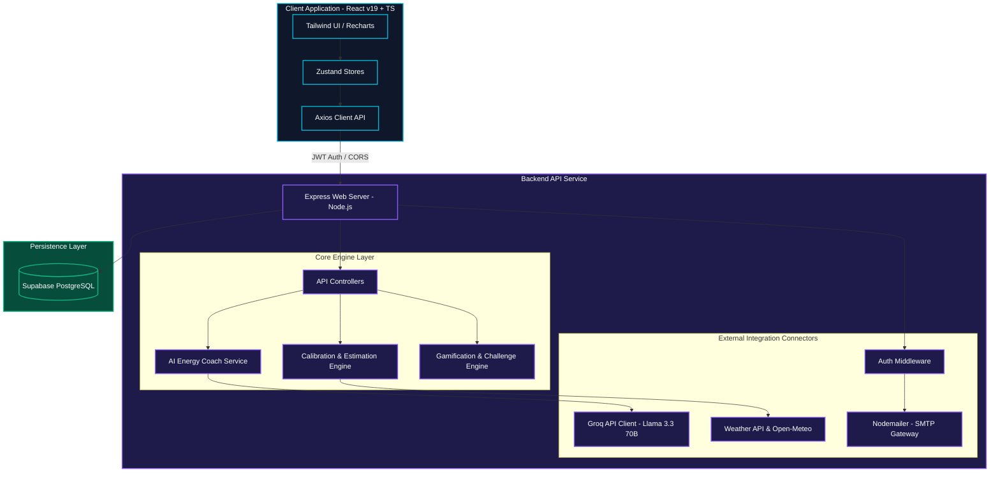
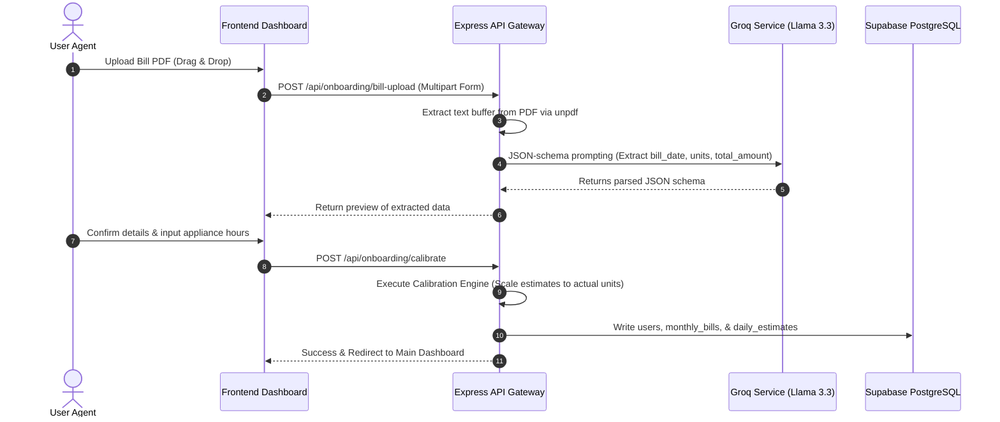
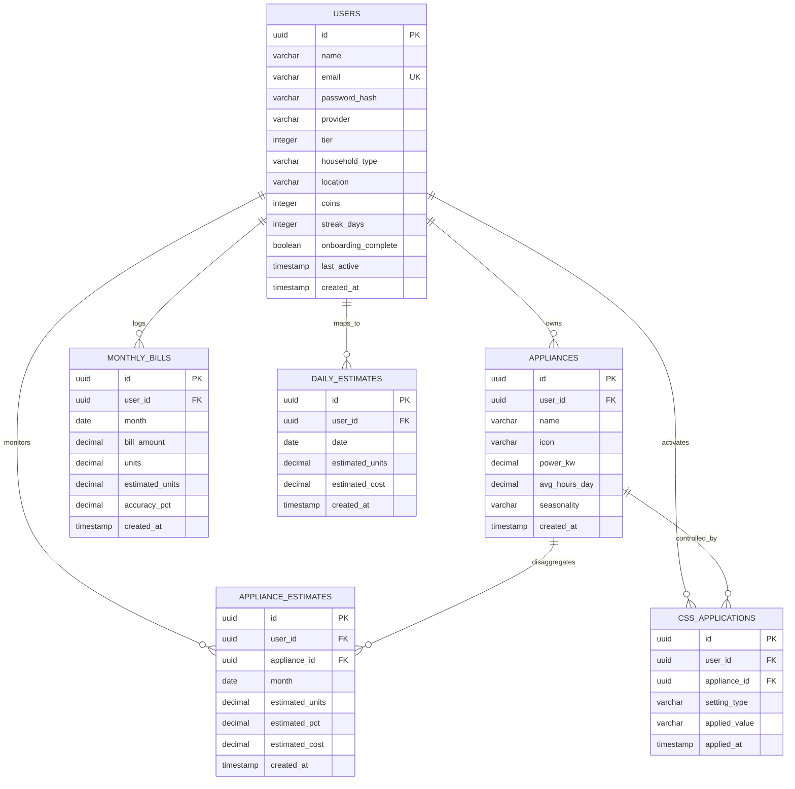
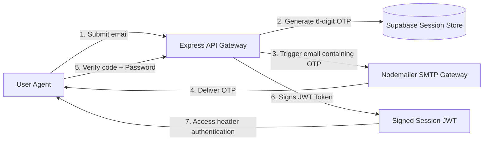

# ⚡ Voltify — Technical Architecture Specification

This document provides a deep-dive analysis of Voltify's technical architecture, component communications, data modeling, algorithm designs, and security enforcement mechanisms.

---

## 🏛️ 1. System Architecture

Voltify is built on a decoupled **Client-Server Architecture** utilizing modular micro-services for weather integration, AI models, estimation processing, and gamification metrics.

---

## 🔁 2. Core Operational Workflows

### 2.1 Multi-Tier Onboarding & Calibration
The system supports three user-calibrating tiers:
1.  **Tier 1 (Smart Plugs)**: Real-time telemetry via plug IDs mapped to hardware tables.
2.  **Tier 2 (Smart Meters)**: Direct API synchronization with regional utilities (DISCOM).
3.  **Tier 3 (Manual Bill Input + AI OCR)**: Drag-and-drop PDF parser.

---

## 🗄️ 3. Database Schema Design (ERD)

Voltify uses a relational PostgreSQL database to ensure strict integrity constraints for user transactions, coin adjustments, and energy auditing logs.

---

## 🧮 4. Calibration & Energy Disaggregation Engine

For users without smart meters, Voltify estimates device-level metrics using a 5-step mathematical calibration process:

### Step 1: Base Consumption Estimation
For each appliance $a$ in the user's inventory, the raw monthly energy estimate ($E_{raw, a}$) is calculated:
$$E_{raw, a} = P_a \times H_a \times D_{month}$$
*Where:*
*   $P_a$ is the power rating of appliance $a$ in kW.
*   $H_a$ is the average daily operational hours.
*   $D_{month}$ is the number of days in the target month (e.g. 30).

### Step 2: Seasonal Weight Modification
Certain high-power appliances require adjustments based on local temperature metrics. We apply seasonal multipliers ($S_a$):
*   **Air Conditioners**: $S_{AC} = 1.0 + 0.15 \times (T_{current} - 28)$ for climates above $28^\circ\text{C}$ ( Chennai / Mumbai summer profile).
*   **Geysers**: $S_{geyser} = 1.0 + 0.10 \times (20 - T_{current})$ for winter profiles (Delhi).
*   **Others**: $S_a = 1.0$.

Adjusted raw monthly estimate ($E_{adj, a}$):
$$E_{adj, a} = E_{raw, a} \times S_a$$

### Step 3: Total Inventory vs. Actual Calibration Scale
Let the total actual units consumed from the electric bill be $U_{actual}$. The total adjusted estimated units is:
$$U_{estimated} = \sum_{a \in A} E_{adj, a}$$

We derive a calibration scalar ($k$):
$$k = \frac{U_{actual}}{U_{estimated}}$$

### Step 4: Calibrated Device Estimates
Every appliance's final calibrated consumption ($E_{final, a}$) is scaled proportionally to match the true monthly total:
$$E_{final, a} = E_{adj, a} \times k$$
This process yields device disaggregation percentages with 100% boundary alignment to the actual utility invoice.

---

## 🔒 5. Security & Authentication Model

*   **Credential Hashing**: Argon2 / bcrypt hashing models.
*   **API Security**: Stateless JSON Web Token (JWT) verification attached via `Authorization: Bearer <token>` request headers.
*   **Rate Limiting**: Configured express-rate-limit bounds (100 requests per 15 minutes for general endpoints, 5 requests per 15 minutes for OTP generators).
